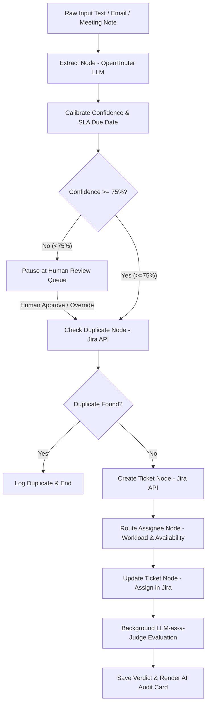

# ⚡ Support Ticket Triage Agent

An autonomous, local-first **LangGraph** support ticket triage and routing agent built with **FastAPI**, **OpenRouter (LLM)**, **SqliteSaver Checkpointing**, **LLM-as-a-Judge Auditing**, and direct **Atlassian Jira Cloud REST API v3** integration.


---

## 🌟 Key Features

### 🔒 1. Local-First Security & Loud Boot Validation
- **Zero Web Credential Exposure**: API keys and tokens are loaded strictly from a local `.env` file—they never cross HTTP or web forms.
- **Loud Boot Check**: The server runs mandatory startup checks against Atlassian Jira and OpenRouter. If credentials are missing or invalid, the process halts immediately with `sys.exit(1)` and a clear terminal error banner.
- **Single-Admin Binding**: Configured to bind exclusively to `127.0.0.1` for local single-instance operation.

### 🧠 2. Autonomous Multi-Node LangGraph Pipeline
- **Entity Extraction**: Extract issue category (`frontend`, `backend`, `billing`, `infra`, `database`, `other`), urgency rating, description, and explicit or SLA-calculated due dates using OpenRouter LLM (`gpt-4o-mini`).
- **Confidence Score Calibration**: Calibrates extraction confidence (0–100%). Ambiguous reports automatically trigger human oversight.
- **Duplicate Detection**: Queries active Jira issues to identify potential duplicate tickets before creation.
- **Direct Jira Issue Creation**: Programmatically creates issues in your Atlassian Jira Cloud project board.

### ⚖️ 3. Context-Aware Workload Routing & Admin Roster
- **Dynamic Workload Balancing**: Queries Jira Cloud API for active open ticket counts per team member and routes new tickets to the least-burdened engineer in the target skill category.
- **Availability Management**: Respects Out of Office (OOO) and Vacation statuses set on the Admin Dashboard (`/admin`), routing around unavailable engineers.
- **Auto Jira Account ID Resolution**: Adding a team member by email automatically fetches their Atlassian Jira Account ID via REST API.

### 🛡️ 4. Confidence-Gated Human-in-the-Loop
- **Automatic Execution Pause**: If extraction confidence is low (<75%), the workflow pauses at `Human Review` using LangGraph checkpoints.
- **Review Queue Panel**: Pending extractions appear on the Triage Dashboard (`/`). Admins can inspect details, override assignees or due dates, and click **Approve** or **Reject**.

### 🔍 5. LLM-as-a-Judge Audit Modal
- **Background Quality Evaluation**: An independent background LLM judge evaluates every completed ticket assignment against routing quality heuristics.
- **Routing Score (0–100) & Discrepancies**: Computes a score, flags potential anomalies (e.g. tight due date, mismatched category), and presents an audit breakdown via the **⚡ AI Review** modal.

---

## 📐 System Architecture & Workflow Flowchart



---

## 🛠️ Tech Stack

- **Core & Workflow**: LangGraph (StateGraph), Python 3.11, `sqlite3` (`SqliteSaver` checkpointing).
- **Backend Framework**: FastAPI, Uvicorn, Pydantic, Server-Sent Events (SSE).
- **LLM Provider**: OpenRouter API (`openai/gpt-4o-mini`).
- **Integrations**: Atlassian Jira Cloud REST API v3 (`requests`).
- **Frontend**: Vanilla JavaScript, Modern Vanilla CSS (Ink/Charcoal Dark Theme).

---

## 🚀 Quick Start & Installation

### 1. Prerequisites
- **Python 3.11+** installed.
- An active **Atlassian Jira Cloud** account (with API token).
- An **OpenRouter API Key**.

### 2. Clone the Repository & Setup Virtual Environment

```bash
git clone https://github.com/Nharshith73/ticket_agent.git
cd ticket_agent

# Create virtual environment
python -m venv venv

# Activate virtual environment
# Windows (PowerShell):
.\venv\Scripts\Activate.ps1
# macOS / Linux:
source venv/bin/activate

# Install dependencies
pip install -r requirements.txt
```

---

## 🔑 Environment Configuration (`.env`)

Copy `.env.example` to `.env` in the project root:

```bash
cp .env.example .env
```

Open `.env` and fill in your credentials:

```ini
# LLM Configuration (OpenRouter)
OPENROUTER_API_KEY=sk-or-v1-your-openrouter-api-key-here
OPENROUTER_MODEL=openai/gpt-4o-mini

# Jira Configuration (.env-only)
JIRA_URL=https://yourdomain.atlassian.net
JIRA_USER_EMAIL=your_atlassian_email@domain.com
JIRA_API_TOKEN=your_atlassian_api_token
JIRA_PROJECT_KEY=FD
```

> 💡 **How to generate an Atlassian API Token**:
> 1. Log in to [id.atlassian.com/manage-profile/security/api-tokens](https://id.atlassian.com/manage-profile/security/api-tokens).
> 2. Click **Create API token**, name it (e.g. `TriageAgent`), and copy the token into `JIRA_API_TOKEN`.

---

## 🏃 Running the Application

Start the server using either of the following commands:

```bash
python server.py
```
*or directly via Uvicorn:*
```bash
uvicorn server:app --host 127.0.0.1 --port 8000 --reload
```

Upon startup, you should see:
```text
[JIRA STARTUP] Successfully authenticated as Jira Account ID '...' for project 'FD'
INFO: Application startup complete.
```

---

## 💻 Web Dashboards

Once the server is running, open your browser:

### 📥 1. Triage Dashboard — [http://127.0.0.1:8000/](http://127.0.0.1:8000/)
- **Text Input**: Paste issue emails or meeting notes.
- **Pipeline Stage Rail**: Live visualization of active execution step.
- **Live Logs**: Server-Sent Events (SSE) streaming real-time logs.
- **Human Review Queue**: Interactive approval card for low-confidence inputs.
- **Recent Outcomes**: Live outcome cards showing assignee, score, and flags with working **⚡ AI Review** modal button.

### ⚙️ 2. Admin Dashboard — [http://127.0.0.1:8000/admin](http://127.0.0.1:8000/admin)
- **Status Badge**: Read-only `.env` connection badge displaying current Jira domain, email, and project key.
- **Add Team Member**: Form to register team members by email and primary skill category. Auto-fetches Atlassian Jira Account ID.
- **Roster & Availability**: Table showing active Jira ticket workloads and availability status dropdown (Available, OOO, Vacation).

---

## 🖥️ Command Line Interface (CLI Usage)

You can also run triage directly from your terminal:

```bash
# Triage text directly
python main.py --text "Mobile checkout modal throwing 500 error on iOS Safari, due tomorrow" --source email

# Triage from a file
python main.py --file sample_notes.txt --source meeting_note
```

---

## 📂 Project Directory Structure

```text
ticket_agent/
├── .env.example          # Template file for environment variables
├── database.py           # SQLite database persistence (logs, queue, roster, verdicts)
├── graph.py              # LangGraph workflow definition and compilation
├── jira_client.py        # Jira Cloud REST API v3 client & boot-time validator
├── log_utils.py          # Real-time SSE broadcaster and log database logger
├── main.py               # Command-line interface for offline/CLI triage
├── nodes.py              # LangGraph node logic (Extraction, Duplicate, Routing, Judge)
├── requirements.txt      # Python dependencies
├── reset_db.py           # Helper script to re-initialize SQLite database schema
├── server.py             # FastAPI local server entry point (127.0.0.1:8000)
├── state.py              # TypedDict state interface definition
├── test_overrides.py     # End-to-end regression test suite for workflow & API
└── templates/
    ├── admin.html        # Admin Dashboard HTML template
    └── index.html        # Triage Pipeline Dashboard HTML template
```

---

## 🧪 Running Tests

To run the automated regression test suite:

```bash
python test_overrides.py
```

---

## 📜 License

Distributed under the MIT License. See `LICENSE` for more information.
